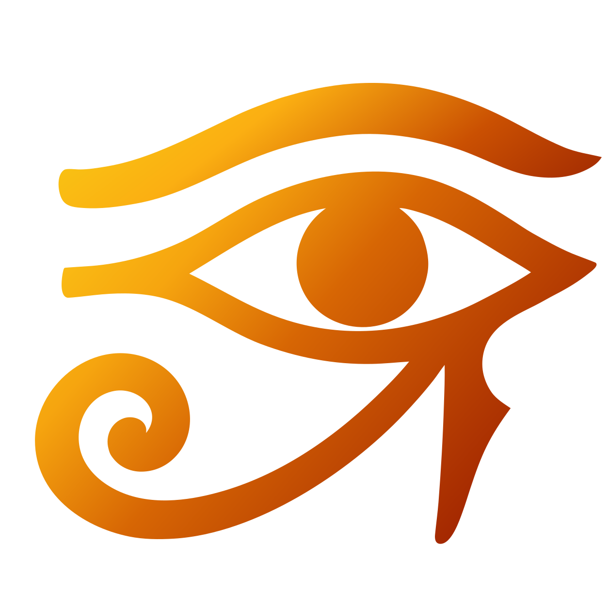
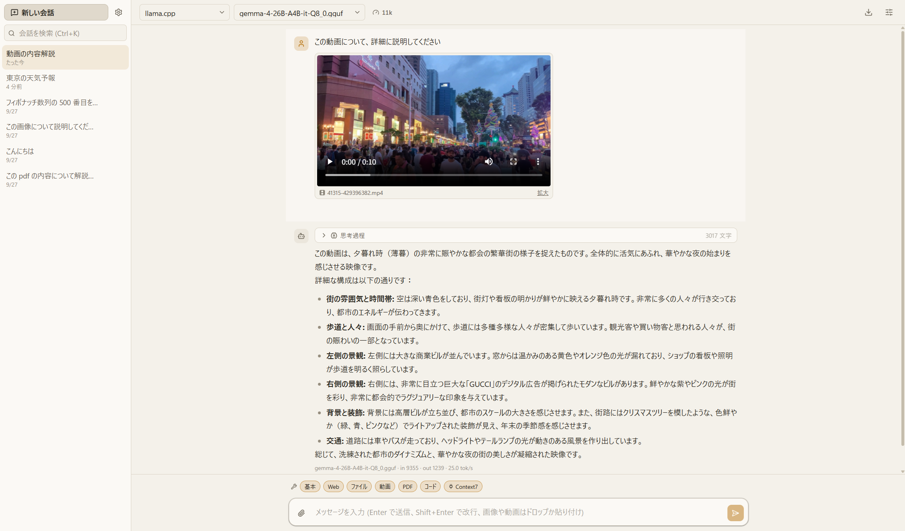

<p align="center">
  
</p>

<h1 align="center">Udjat</h1>

<p align="center">
  LAN 上のローカル LLM サーバーにつなぐ、動画とツール呼び出しに強いデスクトップ用チャットクライアント
</p>

<p align="center">
  <a href="LICENSE"></a>
  
  
</p>



Udjat(ウジャト)は、自分の PC や LAN 内の別 PC で動いている llama.cpp / Unsloth Studio / LM Studio / Ollama / vLLM に接続して使うチャットアプリです。
動画をそのまま添付すると、LLM が自分でツールを呼んで必要なフレームを取り出して理解します。Web 検索、ファイル操作、サンドボックスでのコード実行、MCP サーバーも同じ仕組みで使えます。
クラウドには一切接続しません。会話も添付も、すべて手元の SQLite とフォルダに保存されます。

## できること

**接続先**

- OpenAI 互換 API のローカルサーバー: llama.cpp(`llama-server`)、Unsloth Studio、LM Studio、vLLM。Ollama はネイティブ API
- サーバープロファイルを複数登録し、会話ごとにサーバーとモデルを切り替え
- モデルのロード / アンロード(Unsloth Studio、llama.cpp のルーターモード、LM Studio)。送信直前の自動ロードにも対応
- 画像 / 音声 / 動画 / ツール呼び出し / 思考(thinking)の対応状況をサーバーの申告やチャットテンプレートから自動検出。会話ごとに上書きも可能

**チャット**

- ストリーミング表示、Markdown とコードハイライト、数式、思考過程の折りたたみ
- 会話は木構造。ユーザー発言の編集、応答の再生成、任意の位置からの分岐、分岐の切り替え
- 会話ごとのシステムプロンプトと生成パラメータ(temperature、top_p、コンテキスト長など)
- コンテキスト使用量のメーター。上限が近づいたら会話を要約して圧縮(圧縮前からの分岐はそのまま残る)
- 全文検索、自動タイトル、Markdown / JSON への書き出し、設定のバックアップ

**添付**

- 画像、音声、PDF、テキスト系ファイル(本文を展開して送信)、動画
- 動画は添付時にコンタクトシートを自動生成。LLM は `video_info` / `video_scenes` / `video_contact_sheet` / `video_frames` / `video_clip` で必要な区間だけを見に行く
- 動画をそのまま渡せるサーバー(llama.cpp、vLLM)では、区間を指定した縮小クリップをネイティブ入力として送信
- 添付やツールが取り出したフレームはクリックで拡大表示

**ツール**

- Web 検索(DuckDuckGo / SearXNG / Brave)と Web 取得、ファイルのダウンロード(画像は LLM がそのまま見られる)
- ファイル操作(一覧 / 読み取り / 書き込み)。設定で許可したフォルダの配下だけ
- JavaScript のサンドボックス実行(QuickJS)。ファイル・ネットワーク・ダウンロードは呼び出し時に宣言した範囲だけ許可し、承認カードで確認
- MCP クライアント(stdio / Streamable HTTP)。Claude Desktop と同じ `mcpServers` JSON を取り込み可能。未接続のサーバーは入力欄のチップから再接続
- ツールごとの承認ポリシー(自動 / 毎回確認 / 無効)。拒否時に理由を添えて LLM に伝えられる
- 入力欄のチップでツールのカテゴリを会話ごとに ON / OFF
- 長いツール呼び出し(画像生成の完了待ちなど)はバックグラウンドタスクに切り離し、完了後に応答を自動再開

## インストール

### 配布版(Windows)

1. GitHub の Releases から `Udjat-<version>-win-x64.zip` をダウンロードする
2. 好きな場所に展開し、`Udjat.exe` を起動する

zip にはポータブル運用のための `portable.marker` が同梱されており、会話や添付は exe の隣の `data/` フォルダに保存されます。フォルダごと移動やバックアップができます。
ffmpeg / ffprobe は同梱されているので、別途インストールする必要はありません。

### ソースから起動する

必要なもの: Node.js 24 以上、pnpm 11 以上。ネイティブビルドは不要です(DB は Electron 同梱の `node:sqlite`)。

```bash
git clone <このリポジトリ>
cd Udjat
pnpm install
pnpm dev      # 開発起動(データは ./.dev-data/ に入る)
pnpm dist     # release/ に配布用の zip を生成
```

## 使い方

1. 起動したら「サーバーを登録」からサーバープロファイルを作ります。種別、Base URL(例: `http://192.168.0.10:8080`)、必要なら API キーを入れて「接続テスト」でモデル一覧が取れることを確認します
2. 「新しい会話」を開き、ヘッダーでサーバーとモデルを選びます
3. 画像や動画は入力欄にドロップ、または貼り付けで添付できます。動画の場合は添付チップの「範囲」で見せたい区間を指定できます
4. ツールを使わせる時は、入力欄上のチップでカテゴリを有効にしておきます。承認が必要なツールは応答の中に承認カードが出ます

### サーバー側の準備

| サーバー       | 補足                                                                                                    |
| -------------- | ------------------------------------------------------------------------------------------------------- |
| llama.cpp      | ツール呼び出しには `--jinja` が必要。動画のネイティブ入力にはサーバー側の ffmpeg が必要                 |
| Unsloth Studio | API キーを発行してプロファイルに入れる。モデルのロード / アンロードと量子化の選択に対応                 |
| LM Studio      | ローカルサーバーを起動しておく。モデルのロード / アンロードに対応                                       |
| Ollama         | 動画のネイティブ入力は非対応。クライアント側でフレームに分解して送る。コンテキスト長は `num_ctx` で指定 |
| vLLM           | 動画入力には `--limit-mm-per-prompt` などの起動オプションが必要                                         |

### 設定

設定はヘッダーの歯車から開きます。

- **サーバー**: プロファイルと capability の上書き
- **ツール**: ツールごとの承認ポリシー、Web 検索のバックエンド、ファイルツールの許可フォルダ、システムプロンプトに付ける「ツール利用の手引き」
- **MCP**: サーバーの登録、`mcpServers` JSON の取り込み / 書き出し、ツール呼び出しの制限時間(既定は無制限)
- **一般**: テーマ、ffmpeg のパス、動画のネイティブ入力の上限、コンテキストの自動圧縮、バックアップ

### データの置き場所

| モード   | 条件                                               | 場所                          |
| -------- | -------------------------------------------------- | ----------------------------- |
| portable | exe の隣に `portable.marker` または `data/` がある | exe の隣の `data/`            |
| standard | 上記以外                                           | `%APPDATA%/Udjat`             |
| dev      | `pnpm dev` / 未パッケージ                          | リポジトリ直下の `.dev-data/` |

## セキュリティ上の注意

- Web 取得とダウンロードは、既定で LAN 内(プライベートアドレス)への要求を拒否します。画像生成サーバーなど LAN 上のホストから取る場合は、設定 > ツール > Web の許可ホストに追加してください
- ファイルツールは設定で許可したフォルダの外に触れません。書き込みはフォルダごとに許可が必要です
- サンドボックスのコードは QuickJS(WASM)で実行され、ホストには宣言して承認した権限でしかアクセスできません
- Web 検索の既定バックエンド(DuckDuckGo)は非公式の HTML エンドポイントを使うため、短時間に多く検索するとレートリミットにかかります

## ローカルモデルについて

ツール呼び出し、特にサンドボックスでのコード実行は、モデルによって安定性が大きく変わります。Qwen3.6 系(35B-A3B など)は安定して動きますが、小さいモデルや古い世代のモデルは、ツールの説明を読まずに Node.js 前提のコードを書くことがあります。うまく動かない時は、まずモデルを変えて試してください。

## 開発

```bash
pnpm install
pnpm dev          # 開発起動(HMR)
pnpm typecheck
pnpm lint
pnpm test
pnpm build        # out/ にビルド
pnpm dist         # release/ に zip(ポータブル)を生成
node scripts/make-icons.mjs  # resources/icon.svg からアプリアイコンを作り直す
```

TypeScript は 7.0(ネイティブコンパイラ)を `tsc` に使っています。TS 7.0 には Compiler API がないため、typescript-eslint 用に `typescript` パッケージ名を `@typescript/typescript6` の alias にしています。

```
src/main      Electron main(DB、IPC、LLM 通信、ツール、ffmpeg)
src/preload   contextBridge(sandbox 有効)
src/renderer  React UI
src/shared    main と renderer で共有する型・スキーマ
docs/design   デザインシステム(色、文字、部品の使い分け)
```

UI の色・文字・部品の決めごとは [docs/design/README.md](docs/design/README.md) にあります。

## ライセンス

[MIT](LICENSE)
